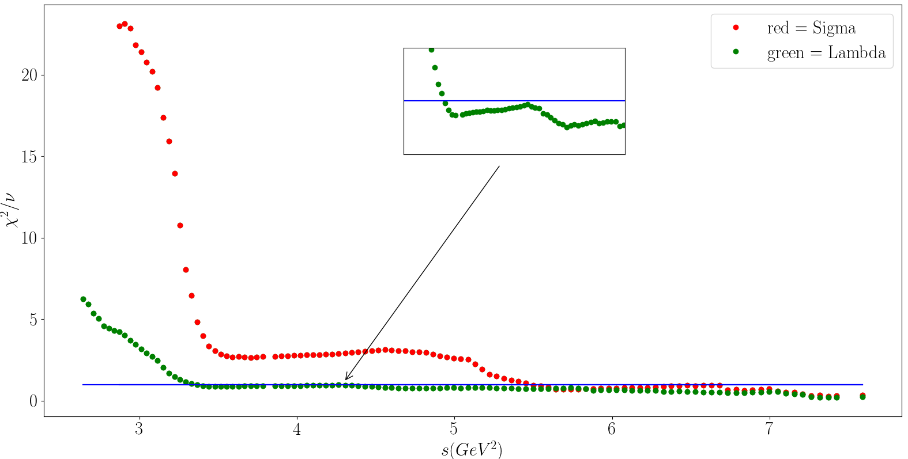
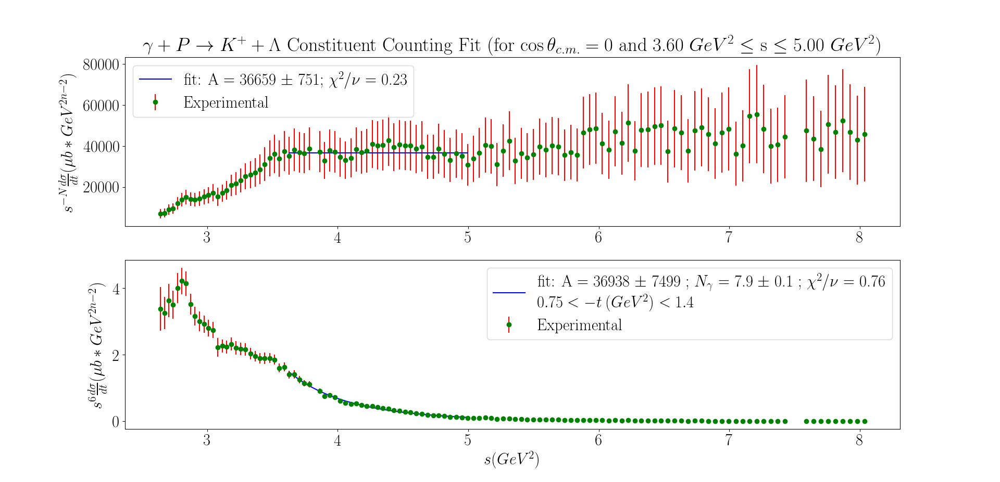

# *A Physical and Statistical Analysis of Lambda(1405)'s Quark Structure*

FIG. 1: &Chi;2/&nu; plotted as a function of s for each interval in (1)
for the reactions &gamma;p -> &Kappa;+&Sigma;0,
&gamma;p -> &Kappa;+&Lambda; 
> (1) s &#8714; [si, sN]i for i = 1,2, ... , N-1
where N is the total number of data points in the s array. 
 

FIG. 2: Cross section of Σ0 fit to As−N for s > 5.45 GeV2, where N = |2−n| (bottom plot). Cross section multiplied by the scale s−N plotted as a function of s (top plot).

FIG. 3: Cross section of Λ fit to As−N for s > 5.0 GeV2, where N = |2−n| (bottom plot). Cross section multiplied by the scale s−N plotted as a function of s (top plot).
